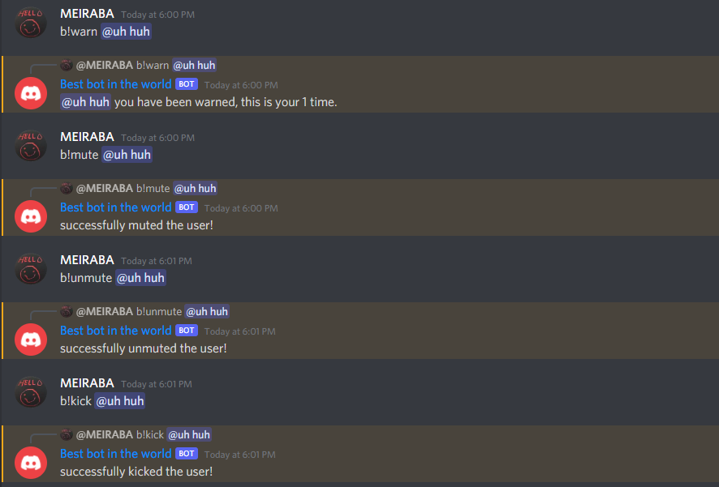
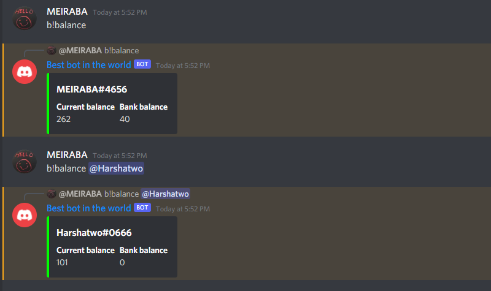
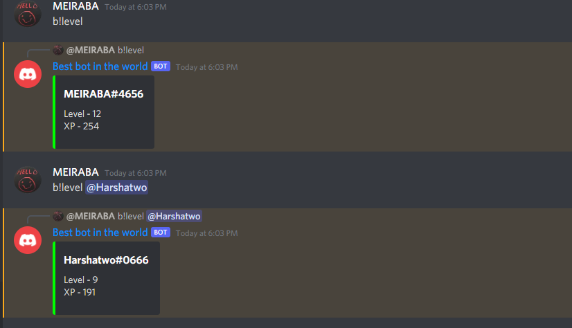
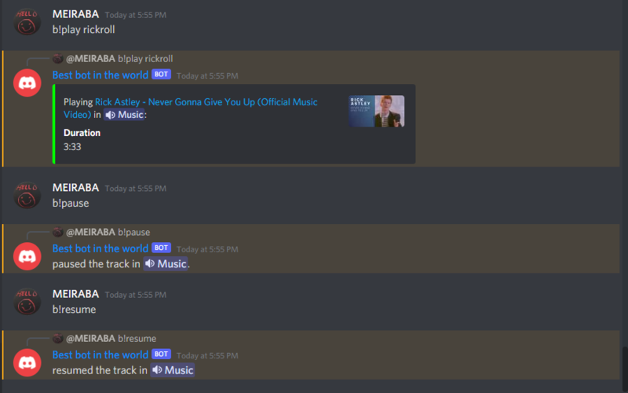
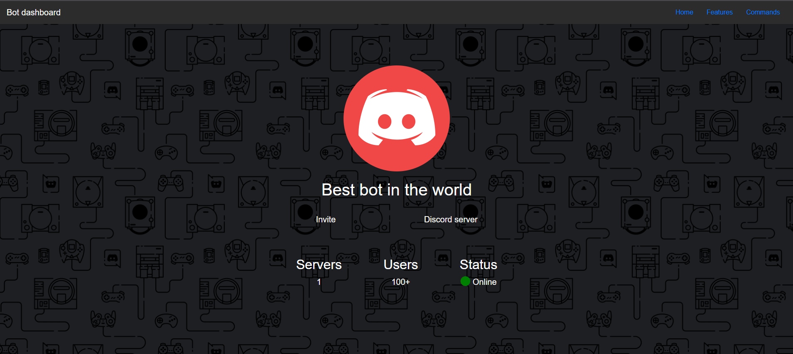

# All in one bot

# Features

Moderation, Economy, Level, Music, Dashboard.

click [here](https://autocode.com/app/noelle-bot/all-in-one/#commands) for all the commands.

# Setup

1. Link your discord bot.
2. Make a copy of [this](https://docs.google.com/spreadsheets/d/1jjTLzJ73e2Dadn8YLh7Tm9OTa27trjUNJQv44d-wySo/edit?usp=sharing) google sheet.

3. Link the copied google sheet.
4. Provide a default prefix, this will be the prefix if a server doesn't have custom prefix

# Dashboard

1. The pictures , title , website icon , home page name , bot invite link and the server count are setup on their own and there is no need to edit them .
2. You must change the images and descriptions in the features section . If you face any trouble pls [contact us](https://autocode.com/app/noelle-bot/all-in-one/#troubleshoot)
3. To change the discord invite link in the home page 
 
just edit the highlighted part.  
4. To add your twitter and discord link in the contact section  
 
just replate the '#' with your link. 
5. To get the link of the website go to dashboard.js and click the link in the bottom of the page. 

# Commands

- Prefix Commands 
1. Moderation

| Name | Description |
| ----------- | ----------- |
| kick | Kick a member from the server |
| ban | Ban a member from the server |
| mute | Mute a memeber in the server |
| unmute | Unmute a member in the server |
| warn | Warn a member in the server |
| report | Report a member in the server |

2. Economy

| Name | Description |
| ----------- | ----------- |
| start | Start this game |
| balance | Check your balance or someone else's |
| give | Give coins to someone |
| deposite | Add coins to your bank |
| withdraw | Take coins from your bank |
| find | Find coins from some place |
| rob | Try to rob someone |
| leaderboard | Check the leaderboard |

3. Setup 

| Name | Description |
| ----------- | ----------- |
| setPrefix | Change the server's prefix |
| setMuteRole | Set a mute role for the server |
| setLogChannel | Set a log channel for the server |
| setWelcomeChannel | Set a welcome channel for the server |

4. Level 

| Name | Description |
| ----------- | ----------- |
| level | Check your level or someone else's |
| leaderboard | Check the leader board |

5. Music

| Name | Description |
| ----------- | ----------- |
| play | Play a music from its name/link |
| pause | Pause the current playing music |
| resume | Resume the paused music |
| skip | Skip to the next music in queue |
| disconnect | Disconnect me from a vc |
| queue | Check the queue or the current playing track |

- Slash Commands 
1. Moderation

| Name | Description |
| ----------- | ----------- |
| /mod kick | Kick a member from the server |
| /mod ban | Ban a member from the server |
| /mod mute | Mute a memeber in the server |
| /mod unmute | Unmute a member in the server |
| /mod warn | Warn a member in the server |
| /mod report | Report a member in the server |

2. Economy

| Name | Description |
| ----------- | ----------- |
| /eco start | Start this game |
| /eco balance | Check your balance or someone else's |
| /eco give | Give coins to someone |
| /eco deposite | Add coins to your bank |
| /eco withdraw | Take coins from your bank |
| /eco find | Find coins from some place |
| /eco rob | Try to rob someone |
| /eco leaderboard | Check the leaderboard |

3. Setup 

| Name | Description |
| ----------- | ----------- |
| /setup prefix | Change the server's prefix |
| /setup mute-role | Set a mute role for the server |
| /setup log-channel | Set a log channel for the server |
| /setup welcome-channel | Set a welcome channel for the server |

4. Level 

| Name | Description |
| ----------- | ----------- |
| /level check | Check your level or someone else's |
| /level leaderboard | Check the leader board |

5. Music

| Name | Description |
| ----------- | ----------- |
| /music play | Play a music from its name/link |
| /music pause | Pause the current playing music |
| /music resume | Resume the paused music |
| /music skip | Skip to the next music in queue |
| /music disconnect | Disconnect me from a vc |
| /music queue | Check the queue or the current playing track |

# Troubleshoot

Contact [Harshatwo#0666](https://discordapp.com/users/752108608484933714) or [MEIRABA#4656](https://discordapp.com/users/627692848841752576) through the [Autocode Developers](https://discord.com/invite/autocode) discord server.

